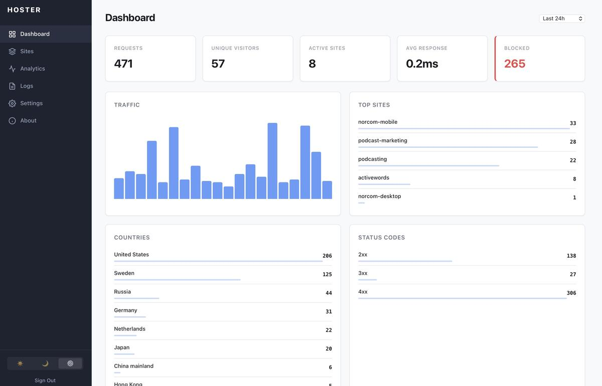
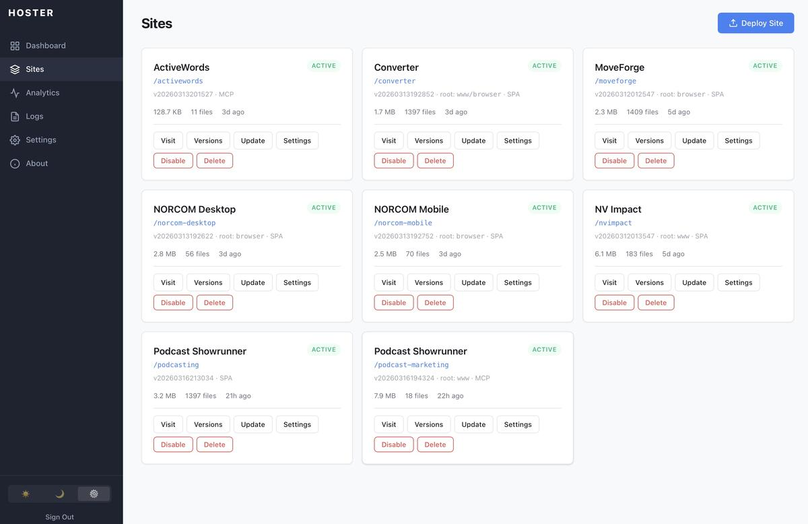
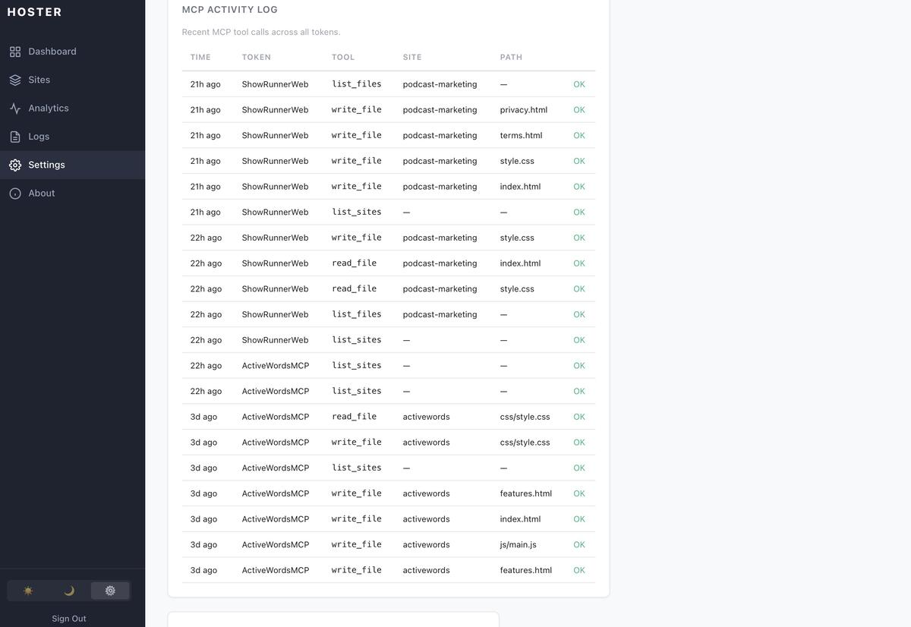
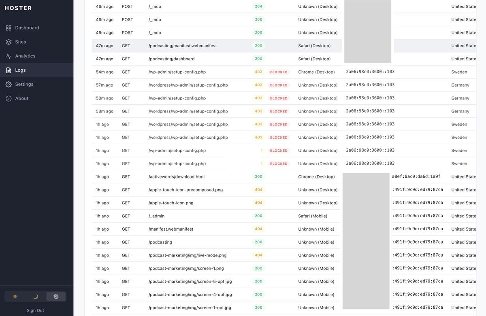

# Hoster

A lightweight, self-hosted web hosting platform that runs on a Raspberry Pi (or any Linux device) and serves sites to the public via [Cloudflare Tunnel](https://developers.cloudflare.com/cloudflare-one/connections/connect-networks/) — no open ports, no dynamic DNS, free SSL.

Upload a ZIP file through the web admin panel and your site is live at `https://yourdomain.com/your-site/` within seconds.



## Features

- **Zero-config HTTPS** — Cloudflare handles SSL termination automatically
- **Web admin panel** — deploy, update, and manage sites from anywhere
- **Version management** — each upload creates a new version; roll back instantly
- **SPA support** — auto-detects Angular, React, and Vue builds; rewrites `<base href>` for subpath hosting
- **Analytics dashboard** — request logs, visitor stats, countries, top pages, status codes, blocked request intelligence, min/avg/max response times
- **IP auto-blocking** — automatically block IPs that accumulate too many denied requests, with configurable thresholds and duration
- **Secure auth** — Argon2id password hashing, TOTP two-factor authentication, session tokens, CSRF protection, rate-limited login
- **Light/Dark/Auto themes** — admin panel respects system preference
- **Single binary** — compiles to a standalone executable with no runtime dependencies
- **MCP server** — expose site files to AI tools (Claude Code, Cursor, etc.) via the Model Context Protocol
- **Tiny footprint** — runs comfortably on a Raspberry Pi with minimal resources

## How It Works

```
User → Cloudflare (HTTPS) → Tunnel → Your Pi (HTTP :3500) → Static Files
```

Sites are served at `yourdomain.com/<slug>/` where each slug maps to an uploaded site. The admin panel lives at `yourdomain.com/_admin`.

## Prerequisites

- A Linux device (Raspberry Pi, VPS, old laptop, etc.)
- [Bun](https://bun.sh) installed on your **build machine** (Mac/Linux) — not needed on the Pi
- A domain name with DNS managed by Cloudflare (free tier works)
- `cloudflared` installed on your Pi

## Setup Guide

### 1. Set Up Cloudflare Tunnel

Install `cloudflared` on your Pi:

```bash
# For Raspberry Pi (ARM64)
curl -L https://github.com/cloudflare/cloudflared/releases/latest/download/cloudflared-linux-arm64 -o cloudflared
sudo mv cloudflared /usr/local/bin/
sudo chmod +x /usr/local/bin/cloudflared

# Authenticate with Cloudflare
cloudflared tunnel login
```

Create a tunnel:

```bash
cloudflared tunnel create hoster
```

This outputs a tunnel ID (UUID) and creates a credentials file at `~/.cloudflared/<TUNNEL_ID>.json`.

### 2. Configure DNS

Route your domain to the tunnel:

```bash
cloudflared tunnel route dns hoster yourdomain.com
```

This creates a CNAME record in Cloudflare DNS pointing your domain to the tunnel.

### 3. Configure the Tunnel

Create the config file at `~/.cloudflared/config.yml`:

```yaml
tunnel: hoster
credentials-file: /home/youruser/.cloudflared/<TUNNEL_ID>.json

ingress:
  - hostname: yourdomain.com
    service: http://localhost:3500
  - service: http_status:404
```

> **Tip:** You can add multiple services on the same device. Just add more ingress rules with different hostnames or subdomains, each pointing to a different local port.

### 4. Install Tunnel as a Service

```bash
sudo cloudflared service install
sudo systemctl enable cloudflared
sudo systemctl start cloudflared
```

> **Important:** When installed as a service, cloudflared reads config from `/etc/cloudflared/config.yml`, not `~/.cloudflared/config.yml`. Make sure your config is in the right place, or copy it:
> ```bash
> sudo cp ~/.cloudflared/config.yml /etc/cloudflared/
> sudo cp ~/.cloudflared/<TUNNEL_ID>.json /etc/cloudflared/
> ```

### 5. Build Hoster

On your build machine (Mac or Linux with Bun installed):

```bash
git clone https://github.com/davidgeller/hoster.git
cd hoster
bash build-pi.sh
```

This compiles a standalone ARM64 binary and packages it into a self-extracting installer (`hoster-pi.sh`).

### 6. Deploy to Your Pi

```bash
scp hoster-pi.sh youruser@yourpi:~/
ssh youruser@yourpi 'bash ~/hoster-pi.sh'
```

### 7. Start Hoster

```bash
# Install as a systemd service
sudo cp ~/hoster/hoster.service /etc/systemd/system/
sudo systemctl daemon-reload
sudo systemctl enable --now hoster

# Check it's running
sudo journalctl -u hoster -f
```

### 8. Set Your Admin Password

Open `https://yourdomain.com/_admin` in your browser. On first visit, you'll be prompted to create an admin password (minimum 8 characters).

### 9. Enable Two-Factor Authentication (Recommended)

After logging in, go to **Settings** and click **Enable 2FA** to add TOTP-based two-factor authentication:

1. Scan the QR code with any authenticator app (Authy, Google Authenticator, 1Password, etc.)
2. Enter the 6-digit code to confirm
3. Save the recovery codes in a safe place — each can only be used once

With 2FA enabled, login requires both your password and a code from your authenticator app. Recovery codes work as a backup if you lose your device.

## Deploying Sites



1. Go to `https://yourdomain.com/_admin`
2. Click **Deploy Site**
3. Enter a slug (e.g., `my-app`) — this becomes the URL path
4. Upload a ZIP file containing your site files
5. Your site is live at `https://yourdomain.com/my-app/`

### Updating a Site

Click **Update** on a site card, upload a new ZIP. This creates a new version while keeping previous versions available for rollback.

### SPA (Single Page App) Support

Hoster automatically detects Angular, React, and Vue builds:

- **Root directory detection** — if your ZIP contains a `browser/`, `dist/`, `build/`, or similar subdirectory with `index.html`, Hoster serves from there
- **Base href rewriting** — `<base href="/">` is automatically rewritten to `<base href="/your-slug/">` so asset paths work correctly under a subpath
- **SPA routing** — enable SPA mode in site Settings to serve `index.html` for all unmatched routes (required for client-side routing)

You can adjust these settings per site via the **Settings** button on each site card.

### Site Aliases

You can create aliases so a site is reachable at multiple URL paths. For example, if your site is deployed at `/ekg`, you can add an alias so it's also accessible at `/ecg`.

1. Go to **Sites** in the admin panel
2. Click **Settings** on the site card
3. In the **Aliases** section, type the alias slug and click **Add Alias**

Aliases share the same content, versions, and settings as the original site. They appear on the site card alongside the primary slug.

## MCP (Model Context Protocol) Support

Hoster includes a built-in MCP server that lets AI tools like Claude Code, Cursor, and other MCP-compatible clients read and write files on your hosted sites.

### Enabling MCP for a Site

1. Go to **Sites** in the admin panel
2. Click **Settings** on a site card
3. Check **MCP Access** (optionally enable **Read Only** to block writes)

### Generating an Access Token

1. Go to **Settings** → **MCP Access Tokens**
2. Enter a label, choose a scope (all sites or a specific site), and set an expiration
3. Click **Generate** — the token is shown once, so copy it immediately
4. Click **Copy Config** to get the full JSON config ready to paste into your AI tool

### Connecting Your AI Tool

When you generate a token, Hoster provides ready-to-copy config using the token's label as the server name. For example, a token labeled "My Project" produces:

**Claude Code (CLI):**

```bash
claude mcp add --transport http my-project https://yourdomain.com/_mcp \
  --header "Authorization: Bearer <your-token>"
```

**JSON config** (Claude Code `settings.json`, Cursor, etc.):

```json
{
  "mcpServers": {
    "my-project": {
      "type": "http",
      "url": "https://yourdomain.com/_mcp",
      "headers": {
        "Authorization": "Bearer <your-token>"
      }
    }
  }
}
```

The server name is derived from the token label, so each token gets a distinct, recognizable name in your AI tool's config.

### Available MCP Tools

| Tool | Description |
|------|-------------|
| `list_sites` | List all MCP-enabled sites |
| `list_files` | List all files in a site's current deployment |
| `read_file` | Read a file (text or base64 for binary) |
| `write_file` | Write/overwrite a file (blocked in read-only mode) |
| `delete_file` | Delete a file (blocked in read-only mode) |

Tokens can be scoped to a single site, set to expire, and revoked at any time. All MCP activity is logged in the **MCP Activity Log** in Settings.



## Upgrading Hoster

On your build machine:

```bash
cd hoster
git pull
bash build-pi.sh
scp hoster-pi.sh youruser@yourpi:~/
ssh youruser@yourpi 'bash ~/hoster-pi.sh && sudo systemctl restart hoster'
```

Your data (admin password, sites, analytics) is preserved across upgrades.

## Verifying Your Setup

```bash
# Check tunnel is connected
sudo systemctl status cloudflared

# Check hoster is running
curl -s http://localhost:3500/_admin/api/version

# Check from the internet
curl -s https://yourdomain.com/_admin/api/version
```

## Project Structure

```
hoster/
├── admin/              # Admin panel (HTML/CSS/JS)
│   ├── index.html
│   ├── style.css
│   └── app.js
├── src/                # Server source (TypeScript)
│   ├── index.ts        # Entry point
│   ├── server.ts       # HTTP server & routing
│   ├── auth.ts         # Authentication & sessions
│   ├── admin-api.ts    # Admin REST API
│   ├── analytics.ts    # Request logging & dashboard queries
│   ├── sites.ts        # Site management & versioning
│   ├── mcp.ts          # MCP server & token management
│   ├── db.ts           # SQLite database setup
│   └── setup.ts        # CLI password setup
├── deploy/
│   └── install.sh      # Pi installer template
├── build-pi.sh         # Build script
├── package.json
└── .gitignore
```

Runtime directories (created on the Pi, not in git):

```
~/hoster/
├── data/               # SQLite database
│   └── hoster.db
├── sites/              # Deployed sites
│   └── <slug>/
│       ├── <version>/  # Timestamped version directories
│       └── _current    # Symlink to active version
├── admin/              # Admin panel assets
└── hoster              # Compiled binary
```

## Security

Hoster is designed to be safe for public exposure. Since the source code is public, security relies on defense in depth rather than obscurity.

### Authentication & Sessions

- Admin password hashed with **Argon2id** (memory-hard, GPU-resistant; memoryCost=64KB, timeCost=3)
- **TOTP two-factor authentication** — RFC 6238 compliant, compatible with all major authenticator apps
- 8 one-time **recovery codes** (SHA-256 hashed, constant-time comparison) for account recovery
- 256-bit cryptographically random session tokens with per-session **CSRF tokens**
- Session cookies are `HttpOnly`, `Secure`, `SameSite=Strict`
- Sessions bound to IP address — stolen tokens cannot be used from a different IP
- Login **rate-limited** to 5 attempts per 15 minutes per IP; 2FA verification separately rate-limited
- 24-hour session duration
- Password change requires current password verification
- **Audit logging** — login, password changes, 2FA enable/disable, and site deletion are logged with IP and timestamp

### Network & Transport

- **No open ports** — all traffic enters through Cloudflare's encrypted tunnel
- Cloudflare provides DDoS protection, WAF, bot management, and IP reputation filtering at the edge
- Country-based access restriction (configurable, uses Cloudflare's `cf-ipcountry` header)
- **IP auto-blocking** — IPs exceeding a configurable number of blocked requests within a time window are automatically denied access. Threshold, window, and block duration are all configurable in Settings. Uses real client IPs from Cloudflare's `cf-connecting-ip` header, so it works correctly behind a tunnel.
- Proxy header trust validation — `cf-connecting-ip` only trusted when Cloudflare signal headers are present
- Security headers: `X-Content-Type-Options`, `X-Frame-Options`, `Referrer-Policy`, `Strict-Transport-Security`, `Content-Security-Policy`, `Permissions-Policy`

### File Serving & Path Traversal

- All file paths validated with `resolve()` + `startsWith()` to prevent directory traversal
- **Symlink resolution** — served files are verified via `realpathSync()` to ensure symlinks don't escape the site directory
- Admin static file paths are bounds-checked against the admin directory
- URL pathname normalization by the URL parser prevents encoded traversal (`%2e%2e`, etc.)

### Upload & Deployment

- Uploaded ZIPs are size-limited (500 MB max)
- ZIP files are extracted to a **staging directory**, validated, then moved to the final location — no unvalidated content is ever served
- All **symlinks are removed** before content is published
- Post-extraction verification ensures no files escaped the target directory (zip slip protection)
- Site slugs validated against strict regex (`[a-z0-9-]+`, no leading/trailing hyphens)
- Site aliases validated with the same rules; aliases cannot shadow existing site slugs or reserved prefixes
- `root_dir` setting validated at configuration time — rejects path traversal sequences

### MCP Access

- Bearer tokens are SHA-256 hashed before storage — raw tokens are never persisted
- Token validation uses **constant-time comparison** to prevent timing attacks
- Tokens can be scoped to a single site, given an expiration date, and revoked instantly
- File path traversal protection (same as static file serving) prevents escape from site directories
- Per-site **read-only mode** blocks write and delete operations
- All MCP tool calls are logged with token label, tool name, site, path, and success/failure

### Data Protection

- Error responses return generic messages — no stack traces, file paths, or SQL details leak to clients
- Errors logged server-side only (visible via `journalctl`)
- Request logs auto-rotate at 500K rows to prevent disk exhaustion
- All SQL queries use parameterized statements (no SQL injection)
- LIKE wildcard characters escaped in search queries
- Query parameter bounds enforced on all analytics endpoints to prevent DoS
- XSS protection via HTML entity escaping on all user-controlled output

### What Cloudflare Handles

- TLS termination (free SSL certificates)
- DDoS mitigation and rate limiting
- Bot detection and challenge pages
- IP reputation and threat intelligence
- HTTP/2 and HTTP/3 support
- Edge caching (configurable per-path)

## Performance

Hoster is optimized for fast, low-memory static file serving:

- **Zero-copy file streaming** — static files are served via Bun's `sendfile` path, never loaded into memory
- **ETag support** — weak ETags based on file mtime+size enable `304 Not Modified` responses, saving bandwidth on repeat visits
- **In-memory site config cache** — site configuration is cached with a 60-second TTL, eliminating database queries and filesystem stat calls from the hot path
- **Cached path resolution** — resolved real paths for site directories are cached, cutting redundant syscalls per request

On a Raspberry Pi 5, this comfortably handles hundreds of concurrent users. Bun.serve itself can handle tens of thousands of requests per second — the bottleneck is never the HTTP layer.

## Analytics

Hoster captures request metadata for every visitor:

- IP address, country, city (via Cloudflare headers)
- User agent, referrer, accept-language
- Request path, method, status code, response time
- All data stored locally in SQLite — nothing sent to third parties

The admin dashboard shows traffic over time, top sites, top paths, countries, status codes, and recent request logs.



### Blocked Request Intelligence

When country restrictions are active, the dashboard surfaces blocked request data to help identify bad actors:

- **Blocked Requests card** — total blocked count prominently displayed in dashboard stats
- **Blocked Countries** — which restricted countries are generating the most requests, with unique IP counts
- **Blocked Paths** — most-targeted paths that were denied, revealing scanning or attack patterns
- **Top Blocked IPs** — repeat offenders ranked by request volume
- **Log viewer chips** — blocked requests in the log table are tagged with a red "Blocked" chip for quick identification
- **Dedicated filter** — filter the log viewer to show only 403 Blocked requests
- **Response time range** — min, average, and max response times displayed in dashboard stats
- **Adaptive chart resolution** — traffic chart uses 5-minute buckets for short time ranges, scaling up to daily buckets for longer views

## Multiple Services on One Device

Cloudflare Tunnel supports multiple ingress rules, so you can run several services on one Pi. Example config:

```yaml
tunnel: my-tunnel
credentials-file: /etc/cloudflared/<TUNNEL_ID>.json

ingress:
  - hostname: api.yourdomain.com
    service: http://localhost:3000
  - hostname: yourdomain.com
    service: http://localhost:3500
  - service: http_status:404
```

## License

MIT
