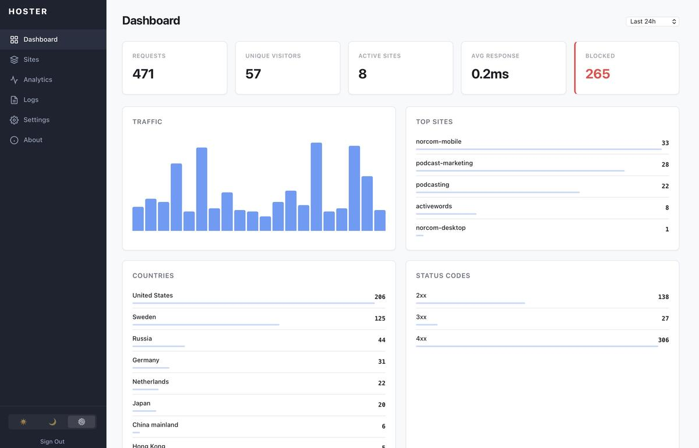
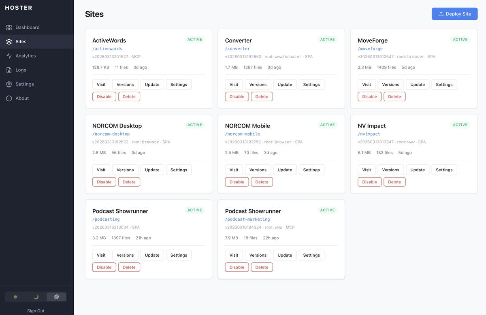
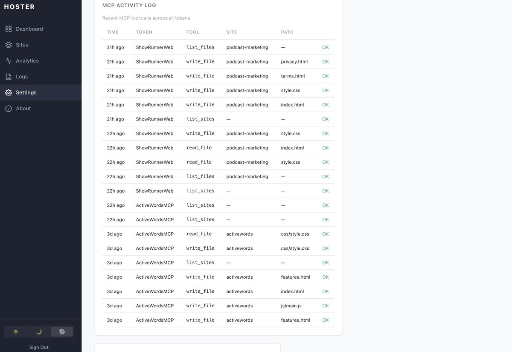
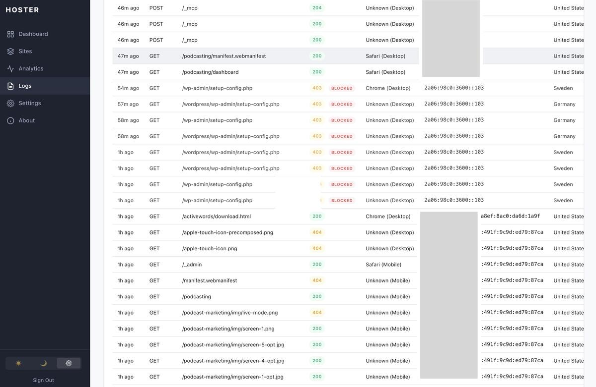

# Hoster

A lightweight, self-hosted web hosting platform that runs as a single Linux binary. Works equally well on a Raspberry Pi behind a [Cloudflare Tunnel](https://developers.cloudflare.com/cloudflare-one/connections/connect-networks/), on a VPS with a public IP and a reverse proxy, or anywhere else a Linux process can run. Multi-site, versioned, with a web admin panel.

Upload a ZIP file through the admin panel and your site is live at `https://yourdomain.com/your-site/` within seconds. Or attach a custom domain so the site lives at its own root.



## What you can use it for

Hoster started as a home-lab Pi project but the same binary works as a general-purpose static-site host on production infrastructure. Real uses:

- **Multi-tenant static hosting** — one server, many sites, each at its own slug or its own custom domain. Drop in a ZIP, get a versioned URL back.
- **A replacement for Firebase Hosting / Netlify / Vercel** for projects that don't need edge CDN or serverless functions. You own the box, no per-build pricing.
- **A staging server for client work** — give each client a slug or a custom subdomain, snapshot before changes, roll back instantly.
- **An AI authoring target** — point Claude Code / Cursor / Claude.ai at a blank site over MCP and let it build the content. Every edit is versioned; auto-snapshot before the first AI write preserves the pre-AI state.
- **A self-hosted analytics-included CDN** for personal projects you don't want third parties tracking. Hoster logs requests locally to SQLite; nothing leaves the box.
- **A drop-in webserver behind nginx/Caddy** when you want admin tooling around static content (versioning, snapshots, host aliases, MCP) without writing your own.

The footprint is small enough to run on a Raspberry Pi with room to spare, but Bun.serve itself handles tens of thousands of requests per second — the constraint is whatever your machine and uplink can deliver.

## Deployment topologies

Hoster speaks plain HTTP on a configurable port (default `3500`). How TLS gets terminated and how requests reach the box is decoupled. Common topologies:

| Topology | TLS terminated by | Best for |
|---|---|---|
| Cloudflare Tunnel | Cloudflare edge | Home lab / Pi behind NAT, no port-forwarding, free SSL, DDoS protection |
| VPS + Cloudflare proxy (orange-cloud DNS) | Cloudflare edge | DigitalOcean / Linode / etc. with an open `:443` and Cloudflare proxying |
| VPS + Caddy reverse proxy | Caddy (Let's Encrypt) | Any VPS, single-binary TLS with auto-renewal, no Cloudflare |
| VPS + nginx reverse proxy | nginx + certbot | Existing nginx setups, custom routing, sharing :80/:443 with other services |
| LAN-only / direct | nothing (HTTP) | Internal tools, dev/staging, behind a VPN |

In every case the Hoster binary itself is identical — only the front-end TLS layer differs.

## Features

- **Zero-config HTTPS** — when paired with Cloudflare or Caddy, certificates and renewal are handled outside Hoster
- **Web admin panel** — deploy, update, and manage sites from anywhere
- **Version management** — each upload creates a new version; roll back instantly
- **SPA support** — auto-detects Angular, React, and Vue builds (with deep root directory detection); rewrites `<base href>` for subpath hosting
- **Custom domains (host aliases)** — point any domain at a specific site so `spryly.com/about` serves the same content as `/spryly/about` on the canonical hostname, with no slug in the URL
- **Configuration backup** — save and restore your entire hoster setup (settings, sites, versions) to a `.hoster` file with optional AES-256-GCM encryption for device migration; restore auto-rebuilds active-version symlinks and reports broken sites
- **Self-healing site state** — `_current` symlinks rebuild at startup, after restore, or on demand from a database-driven repair pass; broken sites surface a red badge in the admin UI
- **Analytics dashboard** — request logs, visitor stats, countries, top pages, status codes, blocked request intelligence, min/avg/max response times
- **IP auto-blocking** — automatically block IPs that accumulate too many denied requests, with configurable thresholds and duration
- **Secure auth** — Argon2id password hashing, TOTP two-factor authentication, session tokens, CSRF protection, rate-limited login
- **Light/Dark/Auto themes** — admin panel respects system preference
- **Single binary** — compiles to a standalone executable with no runtime dependencies
- **MCP server** — expose site files to AI tools (Claude Code, Cursor, etc.) via the Model Context Protocol, with chunked media uploads (JPEG, PNG, GIF, SVG, MP3, MP4), magic-byte / XML-script validation, and server-side `fetch_remote_media` for importing assets from public URLs
- **AI-first authoring** — create blank sites that AI tools populate via MCP; auto-snapshot the working version before the first AI edit so every session has a rollback point; MCP `initialize` returns a context block that briefs the agent on the bound site (including CMS schema when enabled)
- **Optional CMS** — per-site, zero-build, JSON-driven blog/content system with a globally editable vanilla-JS library at `/_cms/cms.js` that every CMS-enabled site shares
- **Bulk uploads** — admin Upload modal accepts multi-file drops and entire folders, preserving directory structure
- **Tiny footprint** — runs comfortably on a Raspberry Pi with minimal resources

## How It Works

```
User → [Cloudflare Tunnel | Cloudflare proxy | Caddy | nginx | nothing]
     → Hoster (HTTP :3500)
     → Static files (versioned, slug- or host-routed)
```

Sites are served at `yourdomain.com/<slug>/` where each slug maps to an uploaded site. Or attach a custom domain via a Host alias and the site lives at the domain root. The admin panel lives at `/_admin`, OAuth/MCP under `/oauth/*` and `/_mcp/*` on the canonical hostname.

## Prerequisites

- A Linux machine — Raspberry Pi, VPS (DigitalOcean, Linode, Hetzner, EC2, etc.), or anything that runs a static binary
- [Bun](https://bun.sh) installed on your **build machine** (Mac/Linux) — not needed on the target host
- A domain (optional but recommended for TLS)
- One of: a Cloudflare Tunnel, a public IP + reverse proxy (Caddy/nginx), or just LAN access

## Setup Guide — Cloudflare Tunnel (Pi or any Linux host behind NAT)

This is the original topology — no open ports, no static IP needed. Skip ahead to [Setup Guide — VPS with a public IP](#setup-guide--vps-with-a-public-ip) if you have a server with `:443` directly reachable.

### 1. Set Up Cloudflare Tunnel

Install `cloudflared` on your Pi:

```bash
# For Raspberry Pi (ARM64)
curl -L https://github.com/cloudflare/cloudflared/releases/latest/download/cloudflared-linux-arm64 -o cloudflared
sudo mv cloudflared /usr/local/bin/
sudo chmod +x /usr/local/bin/cloudflared

# Authenticate with Cloudflare
cloudflared tunnel login
```

Create a tunnel:

```bash
cloudflared tunnel create hoster
```

This outputs a tunnel ID (UUID) and creates a credentials file at `~/.cloudflared/<TUNNEL_ID>.json`.

### 2. Configure DNS

Route your domain to the tunnel:

```bash
cloudflared tunnel route dns hoster yourdomain.com
```

This creates a CNAME record in Cloudflare DNS pointing your domain to the tunnel.

### 3. Configure the Tunnel

Create the config file at `~/.cloudflared/config.yml`:

```yaml
tunnel: hoster
credentials-file: /home/youruser/.cloudflared/<TUNNEL_ID>.json

ingress:
  - hostname: yourdomain.com
    service: http://localhost:3500
  - service: http_status:404
```

> **Tip:** You can add multiple services on the same device. Just add more ingress rules with different hostnames or subdomains, each pointing to a different local port.

### 4. Install Tunnel as a Service

```bash
sudo cloudflared service install
sudo systemctl enable cloudflared
sudo systemctl start cloudflared
```

> **Important:** When installed as a service, cloudflared reads config from `/etc/cloudflared/config.yml`, not `~/.cloudflared/config.yml`. Make sure your config is in the right place, or copy it:
> ```bash
> sudo cp ~/.cloudflared/config.yml /etc/cloudflared/
> sudo cp ~/.cloudflared/<TUNNEL_ID>.json /etc/cloudflared/
> ```

### 5. Build Hoster

On your build machine (Mac or Linux with Bun installed):

```bash
git clone https://github.com/davidgeller/hoster.git
cd hoster
bash build-pi.sh                   # ARM64 (Pi, ARM VPS) — default
# or:
ARCH=x64 bash build-pi.sh          # x86_64 (most VPS droplets)
```

This compiles a standalone binary for the chosen architecture and packages it into a self-extracting installer named `hoster-<arch>.sh` (e.g. `hoster-arm64.sh` or `hoster-x64.sh`).

### 6. Deploy to Your Pi

```bash
scp hoster-arm64.sh youruser@yourpi:~/
ssh youruser@yourpi 'bash ~/hoster-arm64.sh'
```

### 7. Start Hoster

```bash
# Install as a systemd service
sudo cp ~/hoster/hoster.service /etc/systemd/system/
sudo systemctl daemon-reload
sudo systemctl enable --now hoster

# Check it's running
sudo journalctl -u hoster -f
```

### 8. Set Your Admin Password

Open `https://yourdomain.com/_admin` in your browser. On first visit, you'll be prompted to create an admin password (minimum 8 characters).

## Setup Guide — VPS with a public IP

If your machine has a publicly routable IP (DigitalOcean, Linode, Hetzner, EC2, …), you don't need Cloudflare Tunnel. Three popular front-ends:

### Option A — Cloudflare proxy (orange-cloud DNS)

The simplest non-tunnel path. Cloudflare still terminates TLS at the edge and proxies HTTP to your origin.

1. Open `:80` on the droplet's firewall.
2. In Cloudflare DNS, create an `A` record pointing `yourdomain.com` at the droplet's public IP. Keep it proxied (orange cloud).
3. Set SSL/TLS mode to **Flexible** (HTTPS to browser, HTTP origin) or **Full** if you also run TLS on the origin.
4. Hoster listens on `:3500`. Either run a tiny proxy on `:80` (Caddy/nginx, see Option B/C) or change Hoster's port to `80` directly:

   ```bash
   # In /etc/systemd/system/hoster.service, set Environment=PORT=80
   # and grant the binary cap_net_bind_service so non-root can bind :80:
   sudo setcap 'cap_net_bind_service=+ep' /home/youruser/hoster/hoster
   sudo systemctl daemon-reload
   sudo systemctl restart hoster
   ```

### Option B — Caddy reverse proxy (recommended for standalone TLS)

Caddy auto-fetches Let's Encrypt certificates and renews them. Single config file, no Cloudflare required:

```caddyfile
yourdomain.com {
    reverse_proxy localhost:3500
}
spryly.com, www.spryly.com {
    reverse_proxy localhost:3500
}
```

Install Caddy from the official repos, drop the config in `/etc/caddy/Caddyfile`, and `sudo systemctl reload caddy`. The same Hoster service stays unchanged on `:3500`.

### Option C — nginx + certbot

Use when you already run nginx for other services. Sketch:

```nginx
server {
    listen 443 ssl http2;
    server_name yourdomain.com;
    ssl_certificate     /etc/letsencrypt/live/yourdomain.com/fullchain.pem;
    ssl_certificate_key /etc/letsencrypt/live/yourdomain.com/privkey.pem;

    location / {
        proxy_pass http://127.0.0.1:3500;
        proxy_set_header Host              $host;
        proxy_set_header X-Forwarded-For   $remote_addr;
        proxy_set_header X-Forwarded-Proto $scheme;
    }
}
```

> **Note:** Hoster's analytics use Cloudflare's `cf-connecting-ip` and `cf-ipcountry` headers to detect the real client IP and country. Behind a non-Cloudflare proxy, those headers are absent and the dashboard will show your proxy's IP. The IP auto-block feature still works but operates on the proxy IP rather than the visitor IP unless you forward the equivalent headers yourself.

### Build for x86_64 VPS

```bash
ARCH=x64 bash build-pi.sh
scp hoster-x64.sh user@your-vps:~/
ssh user@your-vps 'bash ~/hoster-x64.sh'
```

The installer creates `~/hoster/`, drops a `hoster.service` file you can `sudo cp` into `/etc/systemd/system/`, and the rest follows the same systemd flow as the Pi.

### LAN-only / no public access

Skip TLS entirely and just run Hoster as-is. The admin panel and sites are reachable at `http://<host-ip>:3500/`. Combine with a VPN (Tailscale, WireGuard) for remote access without exposing anything.

### 9. Enable Two-Factor Authentication (Recommended)

After logging in, go to **Settings** and click **Enable 2FA** to add TOTP-based two-factor authentication:

1. Scan the QR code with any authenticator app (Authy, Google Authenticator, 1Password, etc.)
2. Enter the 6-digit code to confirm
3. Save the recovery codes in a safe place — each can only be used once

With 2FA enabled, login requires both your password and a code from your authenticator app. Recovery codes work as a backup if you lose your device.

## Deploying Sites



1. Go to `https://yourdomain.com/_admin`
2. Click **Deploy Site**
3. Enter a slug (e.g., `my-app`) — this becomes the URL path
4. Upload a ZIP file containing your site files
5. Your site is live at `https://yourdomain.com/my-app/`

### Updating a Site

Click **Update** on a site card, upload a new ZIP. This creates a new version while keeping previous versions available for rollback.

For piecemeal edits to an existing version, use **Upload File** instead — the modal accepts one or more files at once and supports dropping entire folders (directory structure is preserved). Use the **Destination Path** field as an optional prefix to place the dropped files into a subdirectory.

### SPA (Single Page App) Support

Hoster automatically detects Angular, React, and Vue builds:

- **Root directory detection** — Hoster recursively searches for the shallowest directory containing `index.html`, handling nested structures like `dashboard_pwa/browser/` automatically. Well-known directories (`browser/`, `dist/`, `build/`, `public/`, `out/`, `www/`) are preferred. The root directory is re-detected on each deploy, so changing your build output structure between versions just works.
- **Base href rewriting** — `<base href="/">` is automatically rewritten to `<base href="/your-slug/">` so asset paths work correctly under a subpath
- **SPA routing** — enable SPA mode in site Settings to serve `index.html` for all unmatched routes (required for client-side routing)

You can adjust these settings per site via the **Settings** button on each site card.

### Creating a Blank Site

For AI-driven authoring workflows, you can create an empty site without uploading a ZIP:

1. Go to **Sites** in the admin panel
2. Click **New Blank Site**
3. Enter a slug and optional display name — the site is created with a placeholder `index.html`
4. Open **Settings** on the new site and enable **MCP Access** so AI tools can populate it

Blank sites work exactly like deployed sites: they version, snapshot, and can be rolled back. The first MCP write replaces the placeholder.

### Version Snapshots

Every deploy creates a version, but you can also snapshot the current working state at any time — useful for marking checkpoints during AI editing sessions:

1. Open **Versions** on a site card
2. Optionally enter a label (e.g. "first draft", "after hero redesign")
3. Click **Snapshot Current**

The current version is frozen under that label and a new mutable copy is forked for further edits. You can roll back to any snapshot from the same Versions dialog.

### Site Aliases

You can create aliases so a site is reachable at multiple URL paths. For example, if your site is deployed at `/ekg`, you can add an alias so it's also accessible at `/ecg`.

1. Go to **Sites** in the admin panel
2. Click **Settings** on the site card
3. In the **Aliases** section, type the alias slug and click **Add Alias**

Aliases share the same content, versions, and settings as the original site. They appear on the site card alongside the primary slug.

### Host Aliases (Custom Domains)

Map a custom domain to a site so visitors hit it at the domain root instead of under a path prefix. For example, if your site lives at `/spryly` on the canonical hostname, you can add `spryly.com` as a host alias and requests to `https://spryly.com/about` will serve the same content as `https://yourdomain.com/spryly/about`.

This is the right choice when:

- You own a vanity domain you want pointed at one specific site
- You want clean URLs without the `/<slug>/` prefix
- You're consolidating projects from other hosts onto Hoster while preserving their domains

#### 1. Add the host alias in Hoster

1. Go to **Sites → Settings** on the site card
2. In the **Host Aliases** section, enter the domain (e.g. `spryly.com`) and click **Add Host**
3. The host appears in the site card listing as `host: spryly.com`

You can add multiple hosts to the same site (for example, both `spryly.com` and `www.spryly.com`).

#### 2. Point DNS to your tunnel

Route the new hostname through the same Cloudflare Tunnel:

```bash
cloudflared tunnel route dns hoster spryly.com
```

This creates a CNAME record on Cloudflare pointing `spryly.com` to your tunnel.

> If `spryly.com` is hosted on a DNS provider other than Cloudflare, you'll first need to add it as a Cloudflare site (free tier works) so Cloudflare can issue the CNAME and provision SSL.

#### 3. Add an ingress rule to your tunnel config

Edit `/etc/cloudflared/config.yml` and add an entry for the new hostname pointing at the same Hoster port:

```yaml
ingress:
  - hostname: spryly.com
    service: http://localhost:3500
  - hostname: www.spryly.com
    service: http://localhost:3500
  - hostname: yourdomain.com           # canonical Hoster hostname
    service: http://localhost:3500
  - service: http_status:404
```

Then reload cloudflared:

```bash
sudo systemctl restart cloudflared
```

That's it — `https://spryly.com/` now serves the site you mapped, with Cloudflare-provisioned SSL.

#### Behavior

- **Path preservation** — `spryly.com/foo/bar` serves the same content as `/spryly/foo/bar` on the canonical hostname; the slug is no longer in the URL
- **Base href** — `<base href="/">` is left as-is on host-aliased requests (instead of being rewritten to `<base href="/spryly/">`), so relative asset paths in HTML resolve at the domain root
- **Admin/MCP/OAuth are canonical-only** — `spryly.com/_admin`, `spryly.com/_mcp`, `spryly.com/oauth/*`, and `spryly.com/.well-known/oauth-*` all return 404. Those surfaces only respond on your canonical Hoster hostname so a custom domain never accidentally exposes them.
- **Path aliases still work** — if the target site has a path alias (e.g. `/spryly` aliases to `/spryly-v2`), host alias resolution runs through the path alias too.

## MCP (Model Context Protocol) Support

Hoster includes a built-in MCP server that lets AI tools like Claude Code, Cursor, Claude.ai, and other MCP-compatible clients read and write files on your hosted sites.

Two transports are supported:

- **Static bearer tokens** at `https://yourdomain.com/_mcp` — for CLI tools (Claude Code, Cursor) that don't need an interactive login. The admin issues a token and pastes it into the tool's config.
- **OAuth 2.1** at `https://yourdomain.com/_mcp/<slug>` — for chat clients (Claude.ai, ChatGPT) that auto-discover the auth server and walk the admin through a consent flow. Each MCP-enabled site is its own OAuth-protected resource with per-site scopes.

Static and OAuth tokens coexist; you can use both at the same time.

### Enabling MCP for a Site

1. Go to **Sites** in the admin panel
2. Click **Settings** on a site card
3. Check **MCP Access** (optionally enable **Read Only** to block writes)

### Generating an Access Token

1. Go to **Settings** → **MCP Access Tokens**
2. Enter a label, choose a scope (all sites or a specific site), and set an expiration
3. Click **Generate** — the token is shown once, so copy it immediately
4. Click **Copy Config** to get the full JSON config ready to paste into your AI tool

### Connecting Your AI Tool

When you generate a token, Hoster provides ready-to-copy config using the token's label as the server name. For example, a token labeled "My Project" produces:

**Claude Code (CLI):**

```bash
claude mcp add --transport http my-project https://yourdomain.com/_mcp \
  --header "Authorization: Bearer <your-token>"
```

By default the server is registered for the current project only. Pick **All projects for this user** in the setup dialog (or pass `--scope user` manually) to make the server available across every project on this machine — useful when you want one Hoster connection wherever you happen to be working:

```bash
claude mcp add --transport http --scope user my-project https://yourdomain.com/_mcp \
  --header "Authorization: Bearer <your-token>"
```

**JSON config** (Claude Code `settings.json`, Cursor, etc.):

```json
{
  "mcpServers": {
    "my-project": {
      "type": "http",
      "url": "https://yourdomain.com/_mcp",
      "headers": {
        "Authorization": "Bearer <your-token>"
      }
    }
  }
}
```

The server name is derived from the token label, so each token gets a distinct, recognizable name in your AI tool's config.

### Connecting a Chat Client (OAuth)

For chat clients that don't accept a static bearer token — Claude.ai web and desktop, ChatGPT custom connectors, etc. — Hoster speaks OAuth 2.1 with the MCP authorization profile.

Each MCP-enabled site is its own connector at `https://yourdomain.com/_mcp/<slug>`. To connect:

1. Go to **Settings → OAuth Connections** in Hoster admin and click **Copy** next to the site you want to connect.
2. In your chat client, choose "Add MCP server" (or equivalent) and paste the URL.
3. The client auto-registers itself, then redirects you to Hoster's consent screen showing the client's name, the target site, and the requested scopes (`read`, `write`, `commit`).
4. Type your admin password (and 2FA code if enabled) and click **Authorize**.
5. The client receives a token and is connected.

The active connection appears in **Settings → OAuth Connections**, where you can revoke it at any time. Revocation is instant — the next request from that client will fail.

### Sharing a Site with a Collaborator (Site Delegates)

If you want to give a friend or client AI access to one site without sharing your admin password, mint a **site delegate** — a per-site password that authorizes the OAuth consent screen for that one site only. Delegates can never reach `/_admin`, never touch other sites, and can be revoked instantly.

1. Open **Site Settings** on the site you want to share.
2. Under **Site Delegates**, enter a label (e.g. `joe` or `acme-client`), choose a password, and pick an expiry. Click **Add**.
3. Hoster shows a copy-pasteable instruction block. Send it to your collaborator — it includes the connector URL, the delegate name, and the password.
4. Your collaborator pastes the connector URL into their chat client. When they hit the consent screen, they enter the delegate name and password instead of leaving the delegate field empty.
5. Each authorization creates an entry in **Settings → OAuth Connections** tagged `delegate <name>` — you can see at a glance which connections came through delegates and revoke any of them.

Deleting a delegate stops new authorizations but leaves any tokens already issued in place until they expire (typically within an hour for access tokens; up to 30 days for refresh). To kill an active connection immediately, revoke it from **Settings → OAuth Connections**.

#### OAuth Scopes

| Scope | Tools |
|---|---|
| `read` | `list_files`, `read_file`, `list_versions` |
| `write` | `write_file`, `write_media_file`, `delete_file` |
| `commit` | `commit_version` |

The chat client requests scopes during the authorize flow; the admin sees them on the consent screen and can decline. Sites configured as **Read Only** silently reduce any granted scopes to `read`.

#### Endpoints

For client implementers:

| URL | Purpose |
|---|---|
| `/.well-known/oauth-authorization-server` | RFC 8414 AS metadata |
| `/.well-known/oauth-protected-resource/_mcp/<slug>` | RFC 9728 resource metadata |
| `/oauth/register` | RFC 7591 Dynamic Client Registration |
| `/oauth/authorize` | Authorization endpoint (PKCE-only) |
| `/oauth/token` | Token endpoint (`authorization_code`, `refresh_token`) |
| `/oauth/revoke` | RFC 7009 token revocation |

Tokens are short-lived (1 hour access, 30-day rotating refresh) and bound to a single site via the `resource` parameter (RFC 8707).

### Available MCP Tools

| Tool | Description |
|------|-------------|
| `list_sites` | List all MCP-enabled sites (now reports `cms_enabled` per site) |
| `list_files` | List all files in a site's current deployment |
| `read_file` | Read a file (text or base64 for binary) |
| `write_file` | Write/overwrite a text file (blocked in read-only mode) |
| `write_media_file` | Write/overwrite an image, vector, or audio/video file (JPEG, PNG, GIF, SVG, MP3, MP4) via base64, with format validation and chunked-upload support up to 100 MB |
| `fetch_remote_media` | Import a media file directly from a public URL (no base64 round-trip). Server fetches the bytes, enforces SSRF defenses, and validates against the destination's expected format |
| `delete_file` | Delete a file (blocked in read-only mode) |
| `list_versions` | List all snapshot versions of a site with labels, sizes, and MCP-modified flags |
| `commit_version` | Freeze the current working state as a labeled snapshot and fork a new mutable copy |

### Media File Uploads

`write_media_file` accepts base64-encoded image, vector, and audio/video content and enforces two layers of validation:

- **Extension allowlist** — only `.jpg`, `.jpeg`, `.png`, `.gif`, `.svg`, `.mp3`, `.mp4` are accepted
- **Content validation**:
  - Binary formats — first chunk must contain a valid magic-byte header (e.g. a `.png` path requires a real PNG header on disk)
  - SVG — must contain a valid `<svg>` root element and may not include `<script>`, `<foreignObject>`, `javascript:` URLs, or inline event handlers (`on*=`), so an agent can't drop in a vector that executes code when a visitor views it directly

For binary formats larger than ~7 MB raw, the tool supports **chunked uploads**: the first call with `append: false` creates and validates the file, and subsequent calls with `append: true` extend it. Per-call payload is limited to 10 MB of base64; total file size is limited to 100 MB. SVG must be uploaded in a single call so the full document is in front of the validator.

### Importing Remote Media

`fetch_remote_media` lets an agent ask Hoster to download an image, vector, or media file from a public URL and write it directly into a site. Useful when building or updating a site that needs assets from a CDN, icon library, or stock-photo site — the bytes never round-trip through chat.

The server does the fetch and applies layered SSRF defenses:

- **Scheme**: only `http:` and `https:`
- **Port**: only 80 and 443
- **DNS**: every resolved `A`/`AAAA` record must be a public unicast address — rejects RFC1918, loopback (127/8, ::1), CGNAT (100.64/10), link-local (169.254/16, fe80::/10, including cloud metadata IPs), multicast, ULA, and documentation ranges
- **Redirects**: followed manually with a max of 5 hops, every hop re-validated
- **Time**: 15 s per request, 30 s total
- **Size**: 50 MB cap, enforced both via `Content-Length` pre-flight and stream-counting (aborts mid-stream if a server lies)
- **Format**: the downloaded bytes must match the destination extension's validator — the same magic-byte / SVG-script check as `write_media_file`

The tool returns the destination path, bytes written, final URL after redirects, content type, and whether a file was replaced. Blocked when the site is read-only.

### Auto-snapshot Before AI Edits

Enable **Auto-snapshot before AI edits** in a site's Settings to automatically freeze the current version the first time MCP writes to it. The pre-AI state is preserved as a labeled snapshot you can roll back to, and the mutable copy gets a `mcp_modified` badge in the Versions dialog so you can see at a glance which versions were touched by an AI session.

Combine with manual `commit_version` calls mid-session for finer-grained checkpoints.

Tokens can be scoped to a single site, set to expire, and revoked at any time. All MCP activity is logged in the **MCP Activity Log** in Settings.



## CMS (Optional, Per-Site)

Hoster includes an optional **JSON-driven content system** that any site can opt into. There's no build step: posts are JSON files, the rendering library is vanilla JS, and editing a JSON file = publishing. Designed so AI tools can author content via MCP without any framework knowledge.

### Enabling It

1. Open **Site Settings** on the site you want to add a blog to
2. Switch to the **CMS** tab and tick **CMS**
3. Click **Save**

Hoster scaffolds a `.cms/` directory inside the site:

```
.cms/
├── VERSION                 — scaffold layout version
├── templates/
│   ├── list.html           — listing page (visited at /<slug>/.cms/templates/list.html)
│   └── story.html          — single-post page (?slug=... + optional ?preview=1)
└── content/
    ├── index.json          — master post list (metadata only — no bodies)
    ├── categories.json     — category definitions
    └── posts/
        └── welcome.json    — sample post (metadata + body)
```

Existing templates and content are preserved on re-init, so you can customize freely.

### The Shared Library

The JS + default CSS live globally at `/_cms/cms.js` and `/_cms/cms.css`, stored in SQLite and shared by every CMS-enabled site. This works on canonical, host-aliased, and path-routed hosts identically.

Edit them once under **Settings → CMS Library** and every CMS-enabled site picks up the change on the next request (clients revalidate via ETag). "Reset to bundled defaults" reverts to whatever shipped with your current Hoster binary.

### Authoring Posts

Post files are flat JSON with a markdown (or HTML) body:

```json
{
  "slug": "my-post",
  "title": "My Post",
  "excerpt": "Short summary shown in listings.",
  "publishedAt": "2026-05-12T09:00:00Z",
  "updatedAt": "2026-05-12T09:00:00Z",
  "categories": ["announcements"],
  "tags": ["intro"],
  "author": "Name",
  "coverImage": null,
  "draft": false,
  "body": { "format": "markdown", "content": "# Heading\n\nBody…" },
  "seo": { "metaDescription": null, "ogImage": null }
}
```

Adding a post is two writes: the new `posts/<slug>.json` plus a matching metadata entry spliced into `index.json` (the index never carries body content).

When MCP connects to a CMS-enabled site, the `initialize` response includes the full schema and the read-mutate-write-index pattern as context — so any agent that opens the connection gets briefed automatically and doesn't need to be told the layout.

### Drafts

Set `"draft": true` in both the post file and its index entry. Drafts are hidden from listings and single-post views by default. Append `?preview=1` to any CMS URL to reveal them; drafts render with a `cms-draft` CSS class and a visible badge.

### Styling

All custom elements render into the light DOM with documented `.cms-*` class names (`.cms-title`, `.cms-meta`, `.cms-body`, `.cms-card`, `.cms-draft`, etc.). Your site's regular CSS targets them directly — no shadow DOM, no overrides needed.

## Configuration Backup & Restore

Hoster can save its entire configuration — settings, sites, and file data — to a single `.hoster` file for backup or device migration.

### Saving a Backup

1. Go to **Settings** → **Configuration Backup**
2. Optionally enter a password to encrypt the backup
3. Choose whether to include all site versions or just the current version of each site (default)
4. Click **Save Configuration** — the file downloads to your browser

### Loading a Backup

1. In the same section, drop or select a `.hoster` file
2. Enter the password if the backup was encrypted
3. Click **Load Configuration** — a confirmation dialog shows what's in the backup
4. Click **Replace Everything** to proceed

Loading a backup replaces all settings, sites, and data. Sessions are cleared, so you'll be redirected to log in with the restored password.

After restore, Hoster automatically walks every restored site and rebuilds its `_current` symlink from the recorded active version. The restore-success summary reports how many symlinks were rebuilt and lists any sites whose version directory is missing as warnings — so you see broken sites immediately instead of discovering them by clicking through later. The same rebuild also runs at server startup (self-heal) and is exposed as a **Repair All Sites** button under Settings → Repair Sites for manual triggering.

Sites whose on-disk state doesn't match the database appear in the admin UI with a red **Broken** badge, with a tooltip showing the specific problem (missing version directory, missing `_current` symlink, `_current` pointing at the wrong version, or no current version recorded).

### What's Included

| Data | Included |
|------|----------|
| Admin password, TOTP secret, recovery codes | Yes |
| Country restrictions, auto-block config | Yes |
| All sites (files, versions, aliases) | Yes (current version only by default) |
| MCP tokens (hashed), blocked IPs | Yes |
| Sessions, login attempts, analytics logs | No |

### File Format

The `.hoster` file is a standard ZIP archive containing a `manifest.json`, `database.json`, and the `sites/` directory. When a password is provided, the entire ZIP is encrypted with AES-256-GCM using a PBKDF2-derived key (100,000 iterations, SHA-256).

## Upgrading Hoster

On your build machine:

```bash
cd hoster
git pull

# Pi or ARM VPS:
bash build-pi.sh
scp hoster-arm64.sh youruser@yourhost:~/
ssh youruser@yourhost 'bash ~/hoster-arm64.sh && sudo systemctl restart hoster'

# x86_64 VPS (DigitalOcean default droplets, most cloud providers):
ARCH=x64 bash build-pi.sh
scp hoster-x64.sh youruser@yourhost:~/
ssh youruser@yourhost 'bash ~/hoster-x64.sh && sudo systemctl restart hoster'
```

Your data (admin password, sites, analytics) is preserved across upgrades. The startup self-heal also rebuilds any missing `_current` symlinks automatically — so even if a previous upgrade or restore left sites in a half-broken state, restarting picks them up.

## Verifying Your Setup

```bash
# If using Cloudflare Tunnel, check it's connected:
sudo systemctl status cloudflared

# Check hoster is running:
sudo systemctl status hoster
curl -s http://localhost:3500/_admin/api/version

# Check from the internet:
curl -s https://yourdomain.com/_admin/api/version
```

## Project Structure

```
hoster/
├── admin/              # Admin panel (HTML/CSS/JS)
│   ├── index.html
│   ├── style.css
│   └── app.js
├── src/                # Server source (TypeScript)
│   ├── index.ts        # Entry point
│   ├── server.ts       # HTTP server & routing
│   ├── auth.ts         # Authentication & sessions
│   ├── admin-api.ts    # Admin REST API
│   ├── analytics.ts    # Request logging & dashboard queries
│   ├── sites.ts        # Site management & versioning
│   ├── backup.ts       # Configuration backup & restore
│   ├── mcp.ts          # MCP server & token management
│   ├── db.ts           # SQLite database setup
│   └── setup.ts        # CLI password setup
├── deploy/
│   └── install.sh      # Pi installer template
├── build-pi.sh         # Build script (ARM64 default; `ARCH=x64 bash build-pi.sh` for x86_64)
├── package.json
└── .gitignore
```

Runtime directories (created on the Pi, not in git):

```
~/hoster/
├── data/               # SQLite database
│   └── hoster.db
├── sites/              # Deployed sites
│   └── <slug>/
│       ├── <version>/  # Timestamped version directories
│       └── _current    # Symlink to active version
├── admin/              # Admin panel assets
└── hoster              # Compiled binary
```

## Security

Hoster is designed to be safe for public exposure. Since the source code is public, security relies on defense in depth rather than obscurity.

### Authentication & Sessions

- Admin password hashed with **Argon2id** (memory-hard, GPU-resistant; memoryCost=64KB, timeCost=3)
- **TOTP two-factor authentication** — RFC 6238 compliant, compatible with all major authenticator apps
- 8 one-time **recovery codes** (SHA-256 hashed, constant-time comparison) for account recovery
- 256-bit cryptographically random session tokens with per-session **CSRF tokens**
- Session cookies are `HttpOnly`, `Secure`, `SameSite=Strict`
- Sessions bound to IP address — stolen tokens cannot be used from a different IP
- Login **rate-limited** to 5 attempts per 15 minutes per IP; 2FA verification separately rate-limited
- 24-hour session duration
- Password change requires current password verification
- **Audit logging** — login, password changes, 2FA enable/disable, and site deletion are logged with IP and timestamp

### Network & Transport

- **No open ports** — all traffic enters through Cloudflare's encrypted tunnel
- Cloudflare provides DDoS protection, WAF, bot management, and IP reputation filtering at the edge
- Country-based access restriction (configurable, uses Cloudflare's `cf-ipcountry` header)
- **IP auto-blocking** — IPs exceeding a configurable number of blocked requests within a time window are automatically denied access. Threshold, window, and block duration are all configurable in Settings. Uses real client IPs from Cloudflare's `cf-connecting-ip` header, so it works correctly behind a tunnel.
- Proxy header trust validation — `cf-connecting-ip` only trusted when Cloudflare signal headers are present
- Security headers: `X-Content-Type-Options`, `X-Frame-Options`, `Referrer-Policy`, `Strict-Transport-Security`, `Content-Security-Policy`, `Permissions-Policy`

### File Serving & Path Traversal

- All file paths validated with `resolve()` + `startsWith()` to prevent directory traversal
- **Symlink resolution** — served files are verified via `realpathSync()` to ensure symlinks don't escape the site directory
- Admin static file paths are bounds-checked against the admin directory
- URL pathname normalization by the URL parser prevents encoded traversal (`%2e%2e`, etc.)

### Upload & Deployment

- Uploaded ZIPs are size-limited (500 MB max)
- ZIP files are extracted to a **staging directory**, validated, then moved to the final location — no unvalidated content is ever served
- All **symlinks are removed** before content is published
- Post-extraction verification ensures no files escaped the target directory (zip slip protection)
- Site slugs validated against strict regex (`[a-z0-9-]+`, no leading/trailing hyphens)
- Site aliases validated with the same rules; aliases cannot shadow existing site slugs or reserved prefixes
- `root_dir` setting validated at configuration time — rejects path traversal sequences

### MCP Access

#### Static Tokens

- Bearer tokens are SHA-256 hashed before storage — raw tokens are never persisted
- Token validation uses **constant-time comparison** to prevent timing attacks
- Tokens can be scoped to a single site, given an expiration date, and revoked instantly
- File path traversal protection (same as static file serving) prevents escape from site directories
- Per-site **read-only mode** blocks write and delete operations
- All MCP tool calls are logged with token label, tool name, site, path, and success/failure
- Text writes (`write_file`) are capped at 10 MB per call
- Media writes (`write_media_file`) enforce an extension allowlist (JPEG, PNG, GIF, MP3, MP4) plus magic-byte verification on the first chunk, blocking disguised executables (`.exe` renamed to `.jpg`) before any bytes are written to disk
- Media uploads are capped at 10 MB per call (base64) and 100 MB total per file
- **Auto-snapshot** freezes the pre-AI working version on the first MCP write, preserving a rollback point if an AI session corrupts or defaces content
- The `X-Content-Type-Options: nosniff` header is set on all site responses, blocking MIME-sniffing attacks against uploaded polyglot media

#### Residual Risks of MCP Writes

MCP tokens are by design trusted credentials — anyone holding one can modify the sites they're scoped to. A few risk categories are worth understanding:

- **Disk-fill DoS** — there is no per-site storage quota. A compromised token can loop 100 MB media uploads to fill the Pi's disk. Monitor the host's free space and revoke suspicious tokens from the **MCP Activity Log**.
- **Domain reputation** — `write_media_file` restricts content types so the domain can't be used to host arbitrary executables, but a token holder can still upload objectionable media that would be served from your domain until removed.
- **Non-atomic chunked writes** — during a multi-chunk `write_media_file` upload, the target path contains a partial file that is served as-is. Visitors mid-upload see a corrupt asset. Use versioned paths or auto-snapshot if this matters for your workflow.
- **Append-phase polyglots** — a valid media header on chunk 1 followed by arbitrary bytes on subsequent chunks produces a polyglot file on disk. The `nosniff` header blocks browsers from executing this as script, and the file extension remains an allowlisted media type, but the bytes themselves are not re-validated after the first chunk.
- **Auto-snapshot scope** — auto-snapshot only fires on the **first** MCP write to a given working version. Further writes within the same session mutate the working copy; use `commit_version` to create additional checkpoints mid-session.

#### OAuth 2.1 Connections

OAuth-issued tokens stored alongside static tokens (same hashing, expiration, and audit-logging guarantees), with several added properties:

- **Audience binding** — OAuth tokens are bound to a single site at issue time and rejected if presented at a different `/_mcp/<slug>` URL. The `WWW-Authenticate` challenge on a 401 response includes a `resource_metadata` link per RFC 9728.
- **PKCE-only** authorization (S256). Plain `code_challenge_method` is not supported.
- **Single-use authorization codes** with a 60-second lifetime; replay returns `invalid_grant`.
- **Refresh token rotation** — every refresh issues a new access + refresh pair and invalidates the previous one, so a leaked refresh token only works until the legitimate client next refreshes.
- **Per-tool scope enforcement** — `write_file`, `write_media_file`, and `delete_file` require the `write` scope; `commit_version` requires `commit`. Read-only sites silently downgrade any granted scopes to `read`.
- **Consent re-authentication** — every authorization requires either the admin password (and TOTP, if enabled) or a per-site delegate password. The consent flow does not rely on the admin session cookie surviving a cross-site redirect, and rate-limits failed attempts using the same window as admin login.
- **Site delegates** are Argon2id-hashed (same algorithm and parameters as the admin password) and stored per-site with optional expiration. Delete cascades to no longer accept new authorizations under that delegate; existing tokens must be revoked separately. Delegates cannot bypass per-site read-only mode and cannot use TOTP recovery codes (TOTP is admin-only).
- **Anonymous Dynamic Client Registration** — required by the MCP profile so chat clients can self-register. Hoster surfaces all registered clients in **Settings → OAuth Connections** with a one-click delete that cascades to the client's tokens.
- **Open redirect protection** — `redirect_uri` must exactly match a value supplied at registration; mismatches show an error page rather than redirecting.
- **CSP-safe consent screen** — the consent page uses no inline JavaScript; the Deny button is a real form submission so it works under the strict `script-src 'self'` policy.

##### Residual Risks of OAuth

- **Anyone can register a client.** The MCP profile mandates anonymous DCR, so anyone on the internet who hits `/oauth/register` gets a `client_id`. PKCE + the consent password gate prevent that registration from ever obtaining a token without admin approval, but a flood of registrations can still bloat the `oauth_clients` table. The endpoint is globally rate-limited to ~30 registrations per hour and unused clients can be pruned from the admin UI.
- **Phishing the consent screen.** An attacker who registers a client with a misleading `client_name` ("System Update") could trick a careless admin into authorizing it. The consent screen prominently displays the registered name, client URI, and "first time client" warnings, but the human review remains the trust anchor — read what you're approving.
- **Refresh tokens are long-lived.** A leaked refresh token allows silent renewal until detected. Revoke any unrecognized connection from **Settings → OAuth Connections**; revocation is immediate and ends future refreshes.
- **Static tokens still permit cross-site access** when their scope is "All sites" — that's by design for CLI batch tools. OAuth-issued tokens are always single-site, so prefer OAuth when narrower blast radius matters.
- **Site delegate passwords are shared secrets.** Once you send the delegate name and password to a collaborator, they can authorize any number of clients against that site. Treat delegate credentials like any other shared password — share over a secure channel, set an expiry, and revoke when the relationship ends. Delegates can also create OAuth tokens that survive after the delegate row is deleted (up to refresh-token TTL); revoke those tokens explicitly in **Settings → OAuth Connections**.

### Configuration Backup

- Backup export and import require an authenticated admin session with valid CSRF token
- Uploaded backup files are size-limited (500 MB max)
- Restored archives are stripped of symlinks and verified against zip slip (path escape) attacks before any files are written
- Optional **AES-256-GCM encryption** with PBKDF2 key derivation (100,000 iterations, 32-byte random salt) protects backups at rest
- **Unencrypted backups contain sensitive data** — the TOTP secret and recovery code hashes are included. Anyone with an unencrypted `.hoster` file and access to the password hash could potentially compromise the account. Use a password for backups stored off-device.
- Import requires explicit confirmation (`confirm=yes`) to prevent accidental overwrites
- All backup and restore operations are audit-logged with IP address

### Data Protection

- Error responses return generic messages — no stack traces, file paths, or SQL details leak to clients
- Errors logged server-side only (visible via `journalctl`)
- Request logs auto-rotate at 500K rows to prevent disk exhaustion
- All SQL queries use parameterized statements (no SQL injection)
- LIKE wildcard characters escaped in search queries
- Query parameter bounds enforced on all analytics endpoints to prevent DoS
- XSS protection via HTML entity escaping on all user-controlled output

### What Cloudflare Handles

- TLS termination (free SSL certificates)
- DDoS mitigation and rate limiting
- Bot detection and challenge pages
- IP reputation and threat intelligence
- HTTP/2 and HTTP/3 support
- Edge caching (configurable per-path)

## Performance

Hoster is optimized for fast, low-memory static file serving:

- **Zero-copy file streaming** — static files are served via Bun's `sendfile` path, never loaded into memory
- **ETag support** — weak ETags based on file mtime+size enable `304 Not Modified` responses, saving bandwidth on repeat visits
- **In-memory site config cache** — site configuration is cached with a 60-second TTL, eliminating database queries and filesystem stat calls from the hot path
- **Cached path resolution** — resolved real paths for site directories are cached, cutting redundant syscalls per request

On a Raspberry Pi 5, this comfortably handles hundreds of concurrent users. Bun.serve itself can handle tens of thousands of requests per second — the bottleneck is never the HTTP layer.

## Analytics

Hoster captures request metadata for every visitor:

- IP address, country, city (via Cloudflare headers)
- User agent, referrer, accept-language
- Request path, method, status code, response time
- All data stored locally in SQLite — nothing sent to third parties

The admin dashboard shows traffic over time, top sites, top paths, countries, status codes, and recent request logs.



### Blocked Request Intelligence

When country restrictions are active, the dashboard surfaces blocked request data to help identify bad actors:

- **Blocked Requests card** — total blocked count prominently displayed in dashboard stats
- **Blocked Countries** — which restricted countries are generating the most requests, with unique IP counts
- **Blocked Paths** — most-targeted paths that were denied, revealing scanning or attack patterns
- **Top Blocked IPs** — repeat offenders ranked by request volume
- **Log viewer chips** — blocked requests in the log table are tagged with a red "Blocked" chip for quick identification
- **Dedicated filter** — filter the log viewer to show only 403 Blocked requests
- **Response time range** — min, average, and max response times displayed in dashboard stats
- **Adaptive chart resolution** — traffic chart uses 5-minute buckets for short time ranges, scaling up to daily buckets for longer views

## Multiple Services on One Device

Cloudflare Tunnel supports multiple ingress rules, so you can run several services on one Pi. Example config:

```yaml
tunnel: my-tunnel
credentials-file: /etc/cloudflared/<TUNNEL_ID>.json

ingress:
  - hostname: api.yourdomain.com
    service: http://localhost:3000
  - hostname: yourdomain.com
    service: http://localhost:3500
  - service: http_status:404
```

## License

MIT
